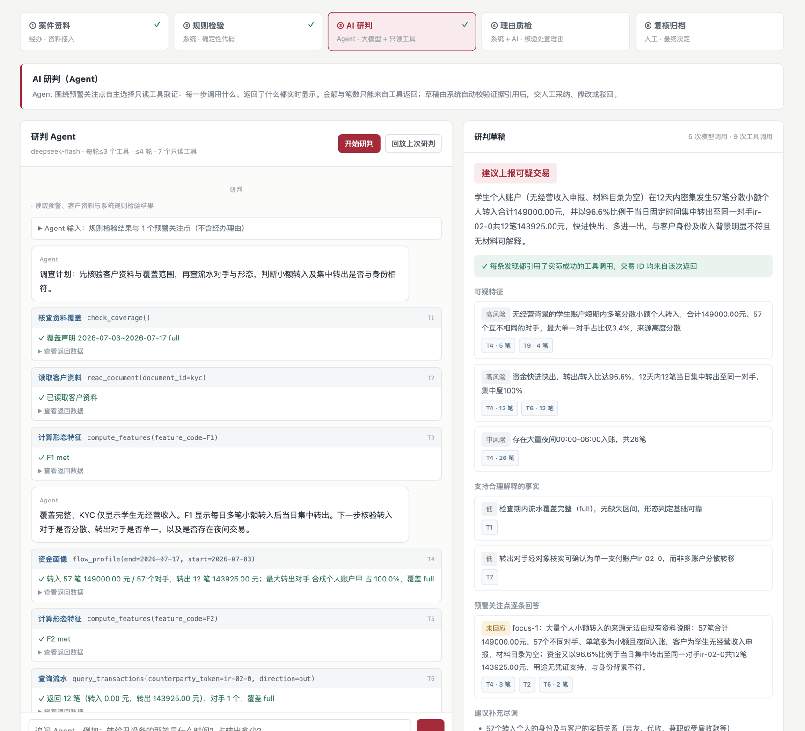
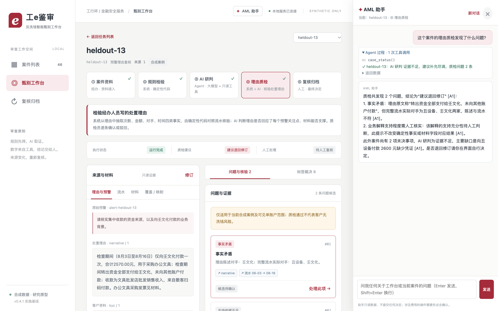

# 工e鉴审 · 基于可审计智能体的反洗钱可疑交易甄别与质检平台

第十七届“工行杯”全国大学生金融科技创新大赛 · 金融安全服务方向参赛作品（工程仓库）。

一条反洗钱预警在本系统中经过五个阶段：**资料接入 → 规则检验 → AI 研判 → 理由质检 → 人工复核归档**。金额、笔数由确定性代码计算；调查取证由受限的研判 Agent 完成，每一步都可见、每条结论都必须引用真实的工具返回；最终结论由人作出，全部操作追加留痕。资料补正后，证据依赖引擎保守增量重查，受影响的人工记录自动标为“需复核”。

> 全部演示与评测数据为团队自建的合成数据，不含真实客户信息。系统输出为辅助建议，不自动报送、不冻结账户、不判定“客户无洗钱风险”。



## 五个阶段

| 阶段 | 负责方 | 做什么 |
|---|---|---|
| ① 案件资料 | 经办 | 上传流水 CSV、预警关注点、客户资料与经办理由，系统建立带版本的案件包 |
| ② 规则检验 | 确定性代码 | F1/F2 资金形态、资金画像（收付合计、对手集中度、同日收付、夜间交易），按整数分计算 |
| ③ AI 研判 | 研判 Agent | 不读经办理由独立调查；自主调用 7 个只读工具；实时显示每一步；给出“建议上报 / 建议排除 / 补充尽调”草稿；可在 AML 助手中继续追问 |
| ④ 理由质检 | 系统 + AI | 把经办理由拆成次数、金额、对手、时间四类事实对照流水核验；判断是否回应每个预警关注点、材料能否支撑 |
| ⑤ 复核归档 | 人工 | 采纳 / 修改 / 驳回 AI 草稿，确认质检问题；资料变化后增量重查；导出审计包 |

## 研判 Agent 如何保证可信

- **受限工具**：`query_transactions`、`flow_profile`、`compute_features`、`check_coverage`、`resolve_entity`、`read_material`、`read_document`，全部只读、限定本案；每轮 ≤3 个，≤4 轮，单次研判 ≤6 次模型调用。
- **编号引用**：系统给每次成功的工具返回编号（T1、T2…）；草稿中每条发现必须引用编号及该次返回中出现过的交易。
- **事后校验**：引用不存在或交易不在该次返回中 → 草稿标为“需关注”；文中金额、笔数与百分比按单位核对（元只对元、笔只对笔，万元换算后比对），在工具返回与给定资料中找不到 → 标出请人工核对；流水覆盖不完整却“建议排除” → 规则拦截。
- **人在回路**：人工决定写入哈希链审计事件；资料更新后旧草稿自动过期，不能再被采纳。

实现见 [`aml_qc/investigation.py`](aml_qc/investigation.py)，提示词见 [`config/prompts/inv-1.2/`](config/prompts/inv-1.2/)。

## AML 助手

工作台每一页右下角都有“✦ AML 助手”（快捷键 ⌘/Ctrl+J），以侧边对话框的形式帮助甄别人员使用工作台、理解当前案件：

- **会用工作台**：回答“怎么上传流水”“证据编号是什么意思”等问题（引用内置使用说明）；按指令列出案件、打开指定案件和阶段。
- **懂当前案件**：知道用户正在看哪个案件、哪个阶段；打开案件后可调用与研判 Agent 相同的只读工具查流水、资金画像和材料，解释 AI 研判结论与质检问题（如“理由原文……：陈述对手 X，完整流水实际对手 Y”）。
- **三级授权**：页面操作直接执行并在对话中显示（打开案件与阶段、按优先级筛选队列、切换资料页签、高亮交易、打开报告初稿、打开上传对话框）；开始研判、勾选报告措施、预填人工决定只能“建议操作”，由用户点击确认；提交人工决定、确认或驳回质检问题、修改资料永远只能由人完成。
- **同样的校验**：每次工具返回编号 A1、A2…，回答中引用了不存在的编号会报错；文中金额、笔数与百分比按同样的单位规则核对，找不到来源的会被标出。每轮 ≤3 个工具、≤4 轮、≤6 次模型调用，费用计入同一上限。
- **离线可用**：未配置 API Key 时显示内置使用说明。



实现见 [`aml_qc/assistant.py`](aml_qc/assistant.py)、[`web/assistant.js`](web/assistant.js)，提示词见 [`config/prompts/assistant-1.0/`](config/prompts/assistant-1.0/)。

## 快速开始

需要 Python 3.11–3.13 与 [uv](https://docs.astral.sh/uv/)。

```sh
uv sync --frozen
cp .env.example .env          # 填写 DEEPSEEK_API_KEY 后可实时研判；不填也能浏览与离线运行
.venv/bin/python -m uvicorn aml_qc.api:app --host 127.0.0.1 --port 8765
```

浏览器打开 http://127.0.0.1:8765 。首次启动自动载入 6 个种子案例；点“上传资料新建案件”可用自己的合成流水 CSV 建案（UTF-8/GBK，英文表头或“交易流水号、借贷标志、交易金额、交易时间、对方账号、对方户名、摘要”等常见中文表头）。深链接示例：`#workspace/seed-02/ai`。

部署到本机以外时，启动前设置 `AML_QC_ACCESS_TOKEN=<令牌>`，所有业务接口须携带该令牌（浏览器首次访问时会提示输入）；`/api/health` 返回数据库与组件状态，可用于监控。

工作台内的实时研判与追问会调用 DeepSeek，单次研判最多 6 次模型调用，累计费用记录在 `runtime/workbench-spend.jsonl`，达到 `AML_QC_SPEND_CAP_CNY`（默认 3 元，按高峰价估算）后停止发送。

```sh
.venv/bin/python -m pytest -q   # 全部回归测试
```

## 评测结果（合成数据，详见作品报告第 6 章）

| 评测 | 数据 | 结果 |
|---|---|---|
| AI 研判（研判 Agent） | 24 个留出合成预警（正常经营 / 跑分过渡账户 / 资料不足各 8 个） | 结论与设计真值一致 24/24；可疑案件被建议排除 0 例；3 份草稿的引用或数字问题被系统自动标出；单案约 0.052 元、13.4 秒 |
| 难例与稳定性（研判 Agent） | 16 个表面特征与结论相反的合成预警（含 2 例提示注入），每案独立运行 2 次 | 29/32 与设计一致（有效草稿 29/30）；可疑案件无一被建议排除；提示注入 4/4 无效；两次结论相同 13/16；2 次输出格式错误按失败计；单次约 0.048 元 |
| 理由质检（Fixed / Agent） | 32 个留出合成案件，8 类注入缺陷 | 两种方法“是否应退回修订”均 26/26 检出、0 误判；事实取值 75/75；资料不全时正确给出“证据不足” |
| 提示词结构化重写回归检查 | 同一留出集 16 案子集 | v2.24：13/13 检出、0 误判、事实取值 37/37；v3.0：13/13 检出、1 误判、事实取值 37/37；v3.1：13/13 检出、0 误判、事实取值 37/37（v3.1 修正针对该子集暴露的问题，仅作回归检查） |
| 增量重查 | 13 类关键变更机制测试 + 真实模型变更 | 与独立全量重算一致；人工需复核记录漏列 0；补正材料/补齐覆盖时模型调用 6 次 vs 全量 18 次 |

真值由生成器设计或注入，不是独立人工参考答案；除难例集外每案每法运行一次。完整分母、误判原因与局限见作品报告第 6 章。

## 目录

| 路径 | 内容 |
|---|---|
| `aml_qc/investigation.py` `flows.py` `agent_api.py` `spend.py` `intake.py` | 研判 Agent、资金画像、研判/助手/上传接口与访问令牌、费用上限、银行导出流水建案 |
| `aml_qc/assistant.py` `str_draft.py` | AML 助手；可疑交易报告初稿（确定性汇编） |
| `aml_qc/core.py` `ingest.py` `schema.py` | 案件校验、覆盖、F1/F2、四类事实核验、材料关系（整数分、半开区间） |
| `aml_qc/workflow.py` `llm.py` `contracts.py` `baseline.py` | 理由质检编排（LangGraph）、模型统一接口、输出契约、B0 直读基线 |
| `aml_qc/depgraph.py` `store.py` `annotations.py` `claim_edits.py` `leads.py` `migrations.py` `exports.py` | 依赖指纹与增量重查、不可变快照、人工作业与审计、规范迁移、导出 |
| `aml_qc/evaluation_budget.py` | 受累计预算约束的模型调用与账本 |
| `web/` | 单页工作台（`stages.js` 为五阶段与 Agent 控制台） |
| `config/prompts/v3.1/` `config/prompts/inv-1.2/` `config/prompts/assistant-1.0/` | 理由质检、研判与助手提示词（版本化） |
| `scripts/generate_*.py` `scripts/score_*.py` | 留出评测集生成与评分 |
| `tests/` | 回归测试 |

## 已知限制

评测真值由生成器设计或注入，不是独立人工标注；数据为合成单账户；重复运行仅难例集 2 次；本地哈希链只检验链条一致性，不防止拥有写权限者重写整链；只有共享访问令牌，未接入统一认证与角色权限。
